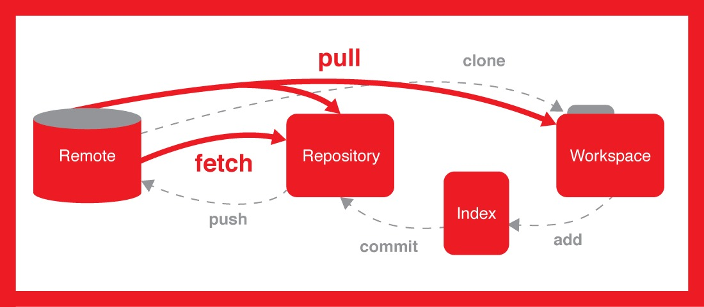

**# Git 命令**

 

 

 

 

 

 

1将本地仓库和远程仓库关联起来：

git remote add origin git@github.com:xxxxxxxxxxxxxxxxxxxxxxxxxxxxxxxxxxx.git

2 远程仓库发生改变后，需要和本地仓库同步才能执行push操作

git fetch origin
git merge origin/master

**一．** **新建代码库**

 

git init  //初始化一个代码库

 

git init 目录 // 将目录初始化一个代码库

 

git clone [url] // 下载一个项目和它的整个代码历史

 

 

**二．** **配置**

 

git config –list  //显示当前配置文件

 

git config -e [--global]  // 编辑配置文件 全局和局部

 

git config [--global] user.name “[name]”

 

git config [--global] user.email “[email address]” // 配置用户信息

 

 

**三．** **删除/增加文件 (工作区和暂存区的交换)**

 

git add [file1] [file2]  // 添加指定文件到暂存区

 

git add [dir] // 添加指定目录到暂存区，包括子目录

 

git add .  // 添加当前所有文件到暂存区

 

 

git rm [file1] [file2] … //删除工作区文件，并将这次删除放入暂存区

 

git rm –cached [file]  //停止追踪指定文件，但该文件会保留在工作区

 

git mv [file-original] [file-renameed]  // 改名文件，并将这个改名放入暂存区

 

 

**四．** **代码提交 （暂存区和仓库区的交换）**

 

git commit –m [message]  // 提交暂存区到仓库区, 并备注

 

git commit [file1] [file2] … -m [message]  // 提交指定暂存区的文件到仓库区

 

git commit –a  // 提交工作区自上次commit之后的变化，直接到仓库区

 

git commit –v  // 提交时显示所有的diff信息

 

git commit –amend –m [message]  // 使用一次新的commit， 替代上一次提交，若代码没有变化，则改写提交信息

 

git commit --amend [file1] [file2] …  // 重做一次commit，并指定新文件的新变化

 

 

五． 分支

 

git branch // 列出所有本地分支

 

git branch –r // 列出所有远程分支

\# 列出所有本地分支和远程分支

$ git branch -a

\# 新建一个分支，但依然停留在当前分支

$ git branch [branch-name]

\# 新建一个分支，并切换到该分支

$ git checkout -b [branch]

\# 新建一个分支，指向指定commit

$ git branch [branch] [commit]

\# 新建一个分支，与指定的远程分支建立追踪关系

$ git branch --track [branch] [remote-branch]

\# 切换到指定分支，并更新工作区

$ git checkout [branch-name]

\# 切换到上一个分支

$ git checkout -

\# 建立追踪关系，在现有分支与指定的远程分支之间

$ git branch --set-upstream [branch] [remote-branch]

\# 合并指定分支到当前分支

$ git merge [branch]

\# 选择一个commit，合并进当前分支

$ git cherry-pick [commit]

\# 删除分支

$ git branch -d [branch-name]

\# 删除远程分支

$ git push origin --delete [branch-name] 

$ git branch -dr [remote/branch]

 

 
